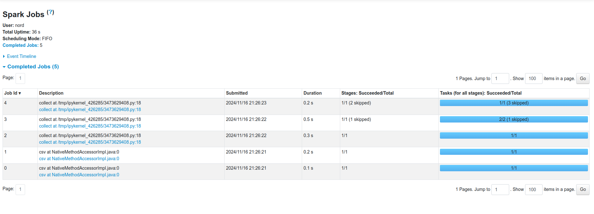
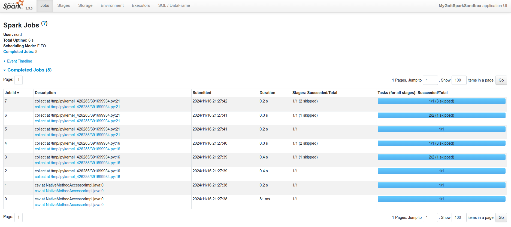
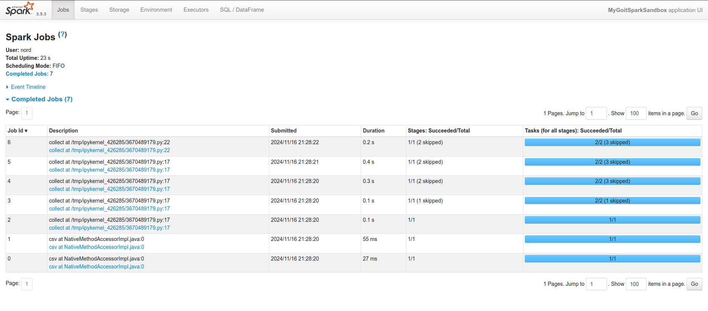

# Task Description and Execution

## Assignment:

Execute three versions of code using Apache Spark and analyze the results in the Spark UI. For each version, the following steps are required:

1. **Run the provided code.**
2. **Take screenshots of all Jobs from the Spark UI.**
3. **Briefly describe the task execution and explain the number of Jobs in each case.**

## Execution:

### Part 1:

**Description:**

- Ran the original code without additional actions.
- The code reads data from a CSV file, applies several transformations, and performs a single `collect()` action.

**Result:**

- **5 Jobs** appeared in the Spark UI.

**Explanation:**

- Each `collect()` action in Spark triggers the execution of all preceding transformations.
- The transformations include filtering, selecting columns, grouping, and aggregation.
- The number of Jobs is related to the need for shuffles during data grouping.

### Part 2:

**Description:**

- Added an intermediate `collect()` action after the first series of transformations.

**Result:**

- **8 Jobs** appeared in the Spark UI.

**Explanation:**

- The additional `collect()` action causes Spark to execute computations twice.
- Since the data is not cached, Spark re-executes all transformations for each action.
- This increases the total number of Jobs because each action requires its own set of computations.

### Part 3:

**Description:**

- Added the `cache()` function after the first series of transformations and before the first `collect()`.

**Result:**

- **7 Jobs** appeared in the Spark UI.

**Explanation:**

- Using `cache()` allows intermediate computation results to be stored in memory.
- Upon subsequent data access, Spark uses the cached data, reducing the number of computations needed.
- This decreases the total number of Jobs compared to Part 2 because redundant computations are avoided.